# 酒店供应链ERP系统 PRD

| PRD 审核人 | 待填写 |
| --- | --- |
| 重要性 | 高 |
| 紧迫性 | 高 |
| 需求方 | 酒店采购管理部 |
| PRD 编写人 | 待填写 |
| PRD 提交日期 | 2026-06-19 |

## PRD 修改记录

| 变更时间 | 变更内容 | 变更提出部门与理由 | 修改人 | 审核人 | 版本号 |
| --- | --- | --- | --- | --- | --- |
| 2026-06-19 | 初始版本 | — | 待填写 | 待填写 | v1.0 |

---

## 第1章 项目背景

### 1.1 业务现状

酒店行业作为典型的资产密集型与服务密集型产业，其日常运营涉及大量的物资采购活动。采购品类覆盖食材、布草、客房易耗品、设备、饮品等多个大类，供应商数量众多，采购流程涉及客房部、餐饮部、采购部、财务部等多个部门协同。

当前，我酒店集团的采购管理主要依赖以下传统方式：

1. **多部门分散采购**：各业务部门（客房部、餐饮部等）独立管理本部门的采购需求，通过口头、电话、微信等方式向采购部提出需求，缺乏统一的采购入口和标准化流程。
2. **手工审批流程**：采购需求的审批通过纸质单据逐级签字传递，审批人不在时流程停滞，审批周期长且无法追踪进度。
3. **纸质单据管理**：采购订单、收货单、付款单等关键业务单据以纸质形式存档，查询困难、易丢失、无法快速统计分析。
4. **信息不透明**：各部门无法实时了解采购进度，管理层无法掌握全局采购数据和供应商表现，决策缺乏数据支撑。

### 1.2 面临问题

基于对现有业务流程的深入调研，当前采购管理面临以下核心问题：

| 问题类别 | 具体表现 | 影响程度 |
| --- | --- | --- |
| 流程效率低 | 采购需求从提出到审批通过平均耗时5-7个工作日，紧急采购无法快速响应 | 高 |
| 成本控制难 | 缺乏供应商比价机制，无法有效控制采购成本；历史价格数据分散，难以进行趋势分析 | 高 |
| 供应商管理混乱 | 供应商信息散落在不同人员的通讯录中，缺乏统一的供应商评估和分级管理机制 | 中 |
| 数据无法追溯 | 采购全链路数据（需求-订单-收货-付款）无法关联查询，出现问题难以追溯责任 | 高 |
| 库存管理粗放 | 库存数据更新不及时，无法实现库存预警，经常出现缺货或积压的情况 | 中 |
| 合规风险高 | 纸质审批流程缺乏审计痕迹，不符合内控合规要求 | 中 |

### 1.3 解决思路

针对上述问题，本项目的核心解决思路是：**建设统一的数字化采购管理平台，实现采购全流程的线上化、标准化和可视化**。

具体策略包括：

1. **流程线上化**：将采购需求申请、审批、订单创建、收货确认、付款结算全流程搬到线上，消除纸质单据和手工传递。
2. **数据集中化**：建立统一的物料主数据、供应商信息库和采购业务数据库，实现数据集中管理和共享。
3. **审批自动化**：引入可配置的多级审批工作流，支持按采购金额、品类等条件自动路由审批节点。
4. **库存可视化**：实时展示库存状况，自动触发低库存预警，辅助采购决策。
5. **报表智能化**：提供多维度的采购分析报表，支持管理层进行数据驱动的采购决策。

### 1.4 决策依据

| 决策维度 | 依据说明 |
| --- | --- |
| 业务必要性 | 采购管理效率直接影响酒店运营成本和客户体验，数字化升级是行业趋势 |
| 技术可行性 | 前后端分离架构成熟，团队具备React/Node.js技术栈开发能力 |
| 经济合理性 | 预计系统上线后可降低采购成本10%-15%，减少审批周期50%以上 |
| 合规要求 | 内部审计要求采购流程全程可追溯，纸质流程无法满足 |

---

## 第2章 需求基本情况

### 2.1 需求提出人

酒店管理层（采购总监、财务总监）

### 2.2 功能使用人

| 角色 | 部门 | 主要职责 | 使用频率 |
| --- | --- | --- | --- |
| 系统管理员 | 信息技术部 | 系统配置、用户管理、权限分配、数据维护 | 每日 |
| 采购专员 | 采购部 | 创建采购需求、管理采购订单、维护供应商和物料信息 | 每日（高频） |
| 财务人员 | 财务部 | 审批采购需求、管理合同、处理付款结算 | 每日 |
| 仓库管理员 | 仓储部 | 收货确认、库存管理、库存盘点 | 每日 |
| 部门经理 | 各业务部门 | 提交采购需求、审批本部门需求 | 每周 |

### 2.3 核心场景

#### 核心场景一：客房部提交布草采购需求

| 六要素 | 描述 |
| --- | --- |
| **参与者** | 客房部经理（王五） |
| **触发条件** | 客房部库存盘点发现毛巾库存低于安全库存线（150条），当前仅剩300条，预计两周内将不足 |
| **前置条件** | 王五已登录系统，具有采购需求创建权限 |
| **主要流程** | 1. 王五进入"采购需求"页面，点击"新建需求"；2. 填写需求标题"布草采购需求"，选择优先级"普通"，设定需求日期和期望到货日期；3. 添加物料明细：床单50条（预估单价85元）、毛巾100条（预估单价25元）；4. 提交需求，系统自动生成需求编号PR-2026-XXXXXX，状态为"待审批"；5. 系统自动创建审批实例，按PR_APPROVAL流程流转；6. 部门主管审批通过后流转至财务审批；7. 财务审批通过后，采购专员可基于该需求创建采购订单 |
| **后置条件** | 需求状态变为"已审批"，采购专员收到通知可创建采购订单 |
| **异常流程** | 审批驳回时，需求状态变为"已驳回"，王五收到驳回原因，可修改后重新提交 |

#### 核心场景二：采购部发起食材集中采购

| 六要素 | 描述 |
| --- | --- |
| **参与者** | 采购专员（张三） |
| **触发条件** | 月度食材采购计划到期，需要向绿源粮油有限公司采购大米和食用油 |
| **前置条件** | 已有审批通过的采购需求（PR-2026-XXXXXX），绿源粮油为合格供应商 |
| **主要流程** | 1. 张三在采购需求列表中找到已审批的食材采购需求；2. 点击"生成订单"，系统自动带入需求明细；3. 选择供应商"绿源粮油有限公司"，填写订单日期、期望交货日期、付款条款（月结30天）、收货地址（酒店后门仓库）；4. 确认物料明细：大米20袋（单价120元）、食用油10桶（单价45元），系统自动计算总金额2850元；5. 提交订单，系统生成订单编号PO-2026-XXXXXX；6. 供应商发货后，仓库管理员确认收货，更新收货数量；7. 财务人员根据收货记录创建付款单，完成结算 |
| **后置条件** | 订单状态变为"已完成"，库存自动更新，付款记录生成 |
| **异常流程** | 收货数量不足时，订单状态为"部分收货"，可分批收货直至全部完成 |

#### 核心场景三：财务人员审批采购需求

| 六要素 | 描述 |
| --- | --- |
| **参与者** | 财务人员（李四） |
| **触发条件** | 收到待审批的采购需求通知 |
| **前置条件** | 李四已登录系统，具有财务审批权限 |
| **主要流程** | 1. 李四进入"审批中心"，查看待审批列表；2. 点击某条采购需求，查看需求详情（需求人、部门、物料明细、预估总金额）；3. 核对预算后，填写审批意见"预算充足，同意"；4. 点击"通过"按钮；5. 系统记录审批历史，更新审批实例状态；6. 若为最后一步审批，采购需求状态自动变为"已审批" |
| **后置条件** | 审批完成，需求人收到审批通过通知 |
| **异常流程** | 发现预算超标，点击"驳回"，填写驳回原因"超出月度预算限额"，需求状态变为"已驳回" |

---

## 第3章 业务分析与系统调研

### 3.1 同类系统调研

#### 3.1.1 内部现有流程

| 环节 | 当前方式 | 存在问题 |
| --- | --- | --- |
| 需求提出 | Excel表格填写，邮件发送给采购部 | 格式不统一，易遗漏，无法追踪状态 |
| 审批流程 | 纸质审批单逐级签字 | 审批周期长（5-7天），无法远程审批，无审批记录 |
| 订单管理 | Excel台账记录 | 数据分散，无法实时查询，易出错 |
| 供应商管理 | 个人通讯录+Excel | 信息不完整，缺乏评估机制 |
| 库存管理 | 手工记账+定期盘点 | 数据滞后，无法实时预警 |
| 付款结算 | 财务系统手工录入 | 与采购订单关联困难，对账效率低 |

#### 3.1.2 外部参考系统

| 系统 | 厂商 | 优势 | 不足 | 适用性 |
| --- | --- | --- | --- | --- |
| 金蝶K/3 Cloud | 金蝶 | 供应链模块成熟，国内酒店行业案例多 | 部署成本高，定制化周期长，与现有系统集成复杂 | 中 |
| 用友U8+ | 用友 | 财务业务一体化，报表功能强大 | 界面老旧，移动端体验差，学习成本高 | 中 |
| SAP S/4HANA | SAP | 全球领先，功能全面，可扩展性强 | 实施成本极高（百万级），对中小企业不友好 | 低 |
| 自研系统 | 内部团队 | 完全贴合业务需求，迭代灵活，成本低 | 需要持续投入研发资源 | 高 |

**结论**：考虑到酒店采购业务的特殊性和定制化需求，以及团队现有的技术能力，选择**企业自研**方案，采用轻量级技术栈（React + Node.js + MySQL）快速构建。

### 3.2 业务痛点优先级

| 优先级 | 痛点 | 影响范围 | 紧迫程度 | 预期收益 |
| --- | --- | --- | --- | --- |
| P0 | 采购审批流程效率低 | 全部部门 | 高 | 审批周期缩短至1-2天 |
| P0 | 采购数据无法追溯 | 采购部、财务部 | 高 | 全链路数据可追溯 |
| P1 | 供应商管理混乱 | 采购部 | 中 | 供应商评估体系建立 |
| P1 | 库存管理粗放 | 仓储部、各业务部门 | 中 | 库存周转率提升20% |
| P2 | 成本分析能力不足 | 管理层 | 中 | 采购成本降低10%-15% |

### 3.3 投入产出初步评估

| 项目 | 预估投入 | 说明 |
| --- | --- | --- |
| 研发人力 | 2名全栈开发 x 3个月 | 前后端开发 |
| 基础设施 | 服务器 + 数据库 约5000元/月 | 云服务器部署 |
| 培训推广 | 1周培训 + 持续运营 | 全员培训 |

| 项目 | 预期收益 | 说明 |
| --- | --- | --- |
| 效率提升 | 审批效率提升60% | 从5-7天缩短至1-2天 |
| 成本节约 | 年采购成本降低10%-15% | 通过供应商比价和集中采购 |
| 管理提升 | 库存周转率提升20% | 通过库存预警和精准采购 |

---

## 第4章 项目收益目标

### 4.1 ROI分析

| 指标 | 当前值 | 目标值 | 改善幅度 |
| --- | --- | --- | --- |
| 单次采购审批周期 | 5-7个工作日 | 1-2个工作日 | 缩短60%-70% |
| 采购需求处理效率 | 15单/人/月 | 30单/人/月 | 提升100% |
| 年度采购成本占比 | 营收的35% | 营收的30%-32% | 降低3%-5% |
| 库存周转天数 | 45天 | 36天 | 缩短20% |
| 供应商准时交付率 | 78% | 90% | 提升12% |

### 4.2 效率提升目标

| 目标维度 | 具体指标 | 目标值 | 达成时间 |
| --- | --- | --- | --- |
| 流程效率 | 采购需求到订单生成平均耗时 | < 3个工作日 | 上线后3个月 |
| 审批效率 | 单次审批平均响应时间 | < 4小时 | 上线后1个月 |
| 数据效率 | 采购数据查询响应时间 | < 2秒 | 上线即达 |
| 操作效率 | 单笔采购需求创建时间 | < 5分钟 | 上线即达 |

### 4.3 采纳率目标

| 阶段 | 目标采纳率 | 覆盖范围 | 时间节点 |
| --- | --- | --- | --- |
| 试点期 | 80% | 采购部 + 财务部 | 上线后1个月 |
| 推广期 | 90% | 全部采购相关部门 | 上线后2个月 |
| 全面运行 | 95% | 全酒店集团 | 上线后3个月 |

---

## 第5章 项目方案概述

### 5.1 功能模块列表

| 序号 | 模块名称 | 优先级 | 说明 |
| --- | --- | --- | --- |
| 1 | 工作台（Dashboard） | P0 | 核心数据概览、待办事项提醒、快捷入口 |
| 2 | 采购需求管理 | P0 | 需求创建、编辑、提交审批、状态跟踪 |
| 3 | 采购订单管理 | P0 | 订单创建、执行跟踪、收货管理 |
| 4 | 审批中心 | P0 | 待审批列表、审批操作、审批历史查询 |
| 5 | 供应商管理 | P1 | 供应商信息维护、报价管理、评级管理 |
| 6 | 物料管理 | P1 | 物料主数据维护、品类管理 |
| 7 | 合同管理 | P1 | 合同创建、状态跟踪、到期提醒 |
| 8 | 付款管理 | P1 | 付款单创建、付款状态跟踪 |
| 9 | 库存管理 | P2 | 库存查询、库存预警、出入库记录 |
| 10 | 数据报表 | P2 | 采购汇总、供应商表现、趋势分析 |

### 5.2 产品方案概述

本系统采用 **B/S架构**，用户通过PC浏览器访问系统，无需安装客户端。产品设计遵循以下原则：

1. **简洁高效**：界面布局清晰，操作路径短，核心功能不超过3次点击即可触达。
2. **角色驱动**：不同角色登录后看到的功能菜单和数据范围不同，减少信息干扰。
3. **数据联动**：采购需求、订单、收货、付款全链路数据自动关联，支持穿透查询。
4. **实时反馈**：关键操作（提交审批、审批通过/驳回等）即时反馈结果。

### 5.3 技术方案概述

| 层级 | 技术选型 | 说明 |
| --- | --- | --- |
| 前端 | React 18 + Vite + React Router | SPA单页应用，端口5173 |
| UI组件 | Ant Design 5.x | 企业级UI组件库 |
| 后端 | Node.js + Express | RESTful API服务，端口3001 |
| 数据库 | MySQL 8.0 (hotel_erp) | utf8mb4字符集，InnoDB引擎 |
| 认证 | JWT (24h有效期) + bcryptjs | 无状态认证，密码加密存储 |
| 主键策略 | UUID v4 | 全局唯一标识符 |

### 5.4 运营方案概述

1. **试点先行**：先在采购部和财务部试点运行，验证核心流程。
2. **培训赋能**：编制操作手册，组织现场培训和线上答疑。
3. **持续迭代**：收集用户反馈，按月迭代优化功能。
4. **数据迁移**：将现有Excel数据清洗后导入系统，确保历史数据可查。

### 5.5 MVP范围

MVP（最小可行产品）范围包含以下核心功能：

- 用户登录认证（JWT）
- 采购需求创建与审批（含两级审批工作流）
- 采购订单创建与状态管理
- 供应商基本信息管理（CRUD）
- 物料基本信息管理（CRUD）
- 工作台数据概览
- 基础库存查询与预警

MVP暂不包含：合同管理、付款管理、数据报表、高级库存管理（出入库事务记录）等功能，将在后续迭代中逐步完善。

---

## 第6章 项目范围

### 6.1 涉及系统

| 系统 | 关系 | 说明 |
| --- | --- | --- |
| 酒店供应链ERP系统（本项目） | 核心系统 | 采购全流程管理 |
| 酒店财务系统 | 下游系统 | 接收付款数据（预留接口） |
| 酒店OA系统 | 上游系统 | 组织架构和人员数据同步（预留接口） |

### 6.2 影响范围

| 影响对象 | 影响内容 | 影响程度 |
| --- | --- | --- |
| 采购部 | 工作方式从Excel+纸质转变为线上系统 | 高 |
| 财务部 | 审批和付款流程线上化 | 高 |
| 客房部/餐饮部等 | 采购需求提交方式改变 | 中 |
| 仓储部 | 收货确认和库存管理方式改变 | 中 |
| 信息技术部 | 系统运维和用户支持 | 中 |

### 6.3 不在本期范围内

以下功能不在本期（v1.0）开发范围内，列入后续版本规划：

1. **移动端适配**：本期仅支持PC Web端，不包含移动APP或微信小程序。
2. **电子签章**：合同签署仍采用线下方式，不集成电子签章功能。
3. **供应商门户**：供应商无法通过外部门户自助报价和查看订单。
4. **预算管理**：不包含预算编制和预算控制功能。
5. **招标管理**：不包含招标、竞价等复杂采购模式。
6. **多语言支持**：仅支持中文界面。
7. **多酒店/多租户**：本期为单酒店部署，不包含集团多酒店模式。
8. **消息通知**：不包含邮件、短信等外部通知渠道（仅系统内消息）。
9. **数据导入导出**：不包含Excel批量导入导出功能。
10. **条码/RFID**：不包含扫码出入库功能。

---

## 第7章 项目风险

### 7.1 前提假设

| 编号 | 假设内容 | 风险等级 |
| --- | --- | --- |
| A1 | MySQL数据库服务稳定可用，数据备份机制完善 | 低 |
| A2 | 用户具备基本的电脑操作能力，能适应Web系统操作 | 中 |
| A3 | 各部门负责人愿意配合推进系统上线，提供业务支持 | 中 |
| A4 | 现有Excel数据格式基本规范，可清洗后导入系统 | 低 |

### 7.2 约束条件

| 编号 | 约束内容 | 说明 |
| --- | --- | --- |
| C1 | 开发周期不超过3个月 | 需严格控制需求范围 |
| C2 | 技术栈限定为React + Node.js + MySQL | 基于团队现有技术能力 |
| C3 | 系统需支持至少50个并发用户 | 酒店员工同时在线数上限 |
| C4 | 单次API响应时间不超过2秒 | 用户体验要求 |

### 7.3 风险清单

| 编号 | 风险类别 | 风险描述 | 发生概率 | 影响程度 | 应对措施 |
| --- | --- | --- | --- | --- | --- |
| R1 | 产品风险 | 用户对新系统接受度低，仍习惯使用Excel | 中 | 高 | 充分培训、简化操作、设置过渡期 |
| R2 | 运营风险 | 数据迁移过程中出现数据丢失或错误 | 低 | 高 | 迁移前完整备份、分批迁移、迁移后数据校验 |
| R3 | 技术风险 | JWT密钥泄露导致系统安全风险 | 低 | 高 | 密钥存储在环境变量中、定期更换、启用HTTPS |
| R4 | 合规风险 | 采购审批流程不符合内控审计要求 | 中 | 高 | 上线前请审计部门审核流程设计、保留完整审批日志 |
| R5 | 业务风险 | 部分供应商不配合提供电子化信息 | 中 | 低 | 采购部协助沟通、系统支持手工录入 |
| R6 | 技术风险 | 数据库并发访问性能不足 | 低 | 中 | 建立合理索引、使用连接池、必要时读写分离 |

---

## 第8章 术语和缩略语

| 术语/缩略语 | 全称 | 说明 |
| --- | --- | --- |
| PR | Purchase Request | 采购需求，各部门提出的物资采购申请 |
| PO | Purchase Order | 采购订单，向供应商发出的正式采购指令 |
| SKU | Stock Keeping Unit | 库存量单位，物料的唯一标识编码 |
| RBAC | Role-Based Access Control | 基于角色的访问控制，通过角色分配权限 |
| JWT | JSON Web Token | JSON网络令牌，用于用户身份认证的无状态方案 |
| SLA | Service Level Agreement | 服务等级协议，与供应商约定的服务质量标准 |
| ERP | Enterprise Resource Planning | 企业资源计划 |
| CRUD | Create/Read/Update/Delete | 增删改查，基本的数据操作 |
| SPA | Single Page Application | 单页应用 |
| API | Application Programming Interface | 应用程序编程接口 |
| REST | Representational State Transfer | 表述性状态转移，一种API设计风格 |
| UUID | Universally Unique Identifier | 通用唯一识别码 |
| FK | Foreign Key | 外键，数据库表之间的关联约束 |
| CASCADE | 级联操作 | 删除主表记录时自动删除关联的子表记录 |
| MVP | Minimum Viable Product | 最小可行产品 |

---

## 第9章 参考文献和引用文档

| 编号 | 文档名称 | 说明 |
| --- | --- | --- |
| [1] | 《酒店采购管理制度》 | 酒店内部采购管理规范文件 |
| [2] | 《酒店财务审批流程规范》 | 财务部审批权限和流程规定 |
| [3] | 《供应商管理办法》 | 供应商准入、评估、退出管理规定 |
| [4] | React官方文档 (https://react.dev) | React前端框架技术文档 |
| [5] | Express官方文档 (https://expressjs.com) | Node.js Web框架技术文档 |
| [6] | MySQL 8.0参考手册 | MySQL数据库技术文档 |
| [7] | JWT RFC 7519 (https://tools.ietf.org/html/rfc7519) | JWT标准规范 |
| [8] | Mermaid官方文档 (https://mermaid.js.org) | Markdown图表语法规范 |

---

## 第10章 功能需求

### 10.1 系统架构与模型

#### 10.1.1 应用架构图

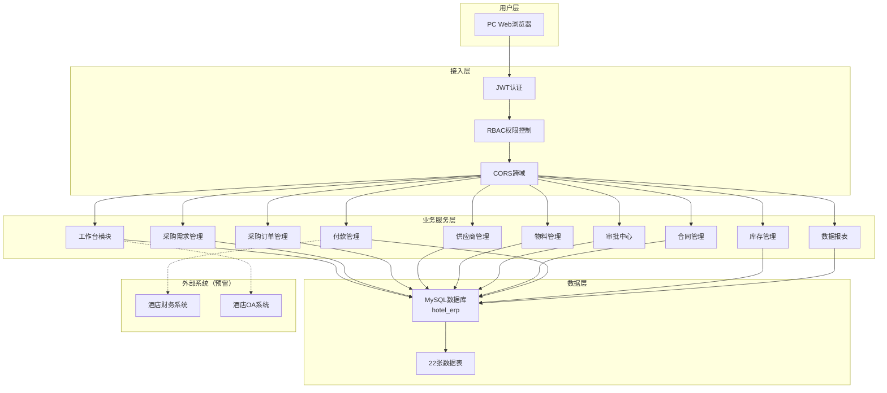

#### 10.1.2 数据模型图

```mermaid
erDiagram
    departments {
        CHAR_36 id PK
        VARCHAR_100 name
        VARCHAR_50 code UK
        TEXT description
        CHAR_36 manager_id FK
        TIMESTAMP created_at
        TIMESTAMP updated_at
    }

    roles {
        CHAR_36 id PK
        VARCHAR_100 name
        VARCHAR_50 code UK
        TEXT description
        JSON permissions
        TIMESTAMP created_at
        TIMESTAMP updated_at
    }

    users {
        CHAR_36 id PK
        VARCHAR_100 username UK
        VARCHAR_255 password_hash
        VARCHAR_100 real_name
        VARCHAR_200 email
        VARCHAR_50 phone
        CHAR_36 department_id FK
        CHAR_36 role_id FK
        TINYINT is_active
        TIMESTAMP last_login_at
        TIMESTAMP created_at
        TIMESTAMP updated_at
    }

    item_categories {
        CHAR_36 id PK
        VARCHAR_100 name
        VARCHAR_50 code UK
        TEXT description
        CHAR_36 parent_id FK
        TINYINT is_active
        TIMESTAMP created_at
        TIMESTAMP updated_at
    }

    items {
        CHAR_36 id PK
        VARCHAR_200 name
        VARCHAR_50 code UK
        VARCHAR_200 specification
        VARCHAR_50 unit
        CHAR_36 category_id FK
        TEXT description
        TINYINT is_active
        TIMESTAMP created_at
        TIMESTAMP updated_at
    }

    suppliers {
        CHAR_36 id PK
        VARCHAR_200 name
        VARCHAR_50 code UK
        VARCHAR_100 contact_person
        VARCHAR_50 phone
        VARCHAR_200 email
        TEXT address
        VARCHAR_200 bank_name
        VARCHAR_100 bank_account
        VARCHAR_100 tax_number
        DECIMAL_3_2 rating
        TINYINT is_active
        TIMESTAMP created_at
        TIMESTAMP updated_at
    }

    supplier_quotes {
        CHAR_36 id PK
        CHAR_36 supplier_id FK
        CHAR_36 item_id FK
        DECIMAL_12_2 price
        VARCHAR_10 currency
        DATE valid_from
        DATE valid_to
        INT min_order_quantity
        INT lead_time_days
        TINYINT is_active
        TIMESTAMP created_at
        TIMESTAMP updated_at
    }

    purchase_requests {
        CHAR_36 id PK
        VARCHAR_50 request_no UK
        VARCHAR_200 title
        TEXT description
        VARCHAR_20 status
        VARCHAR_20 priority
        VARCHAR_20 request_type
        DATE request_date
        DATE required_date
        CHAR_36 requester_id FK
        CHAR_36 department_id FK
        DECIMAL_12_2 total_amount
        CHAR_36 approval_instance_id
        TIMESTAMP created_at
        TIMESTAMP updated_at
    }

    purchase_request_items {
        CHAR_36 id PK
        CHAR_36 request_id FK
        CHAR_36 item_id FK
        DECIMAL_12_2 quantity
        DECIMAL_12_2 estimated_price
        TEXT description
        TIMESTAMP created_at
    }

    workflow_definitions {
        CHAR_36 id PK
        VARCHAR_100 name
        VARCHAR_50 code UK
        TEXT description
        VARCHAR_50 entity_type
        JSON steps
        TINYINT is_active
        TIMESTAMP created_at
        TIMESTAMP updated_at
    }

    approval_instances {
        CHAR_36 id PK
        CHAR_36 workflow_definition_id FK
        VARCHAR_50 entity_type
        CHAR_36 entity_id
        VARCHAR_200 title
        VARCHAR_20 status
        INT current_step
        CHAR_36 initiator_id FK
        TIMESTAMP created_at
        TIMESTAMP updated_at
    }

    approval_history {
        CHAR_36 id PK
        CHAR_36 approval_instance_id FK
        INT step
        CHAR_36 approver_id FK
        VARCHAR_20 action
        TEXT comment
        TIMESTAMP created_at
    }

    purchase_orders {
        CHAR_36 id PK
        VARCHAR_50 order_no UK
        CHAR_36 request_id FK
        VARCHAR_200 title
        TEXT description
        VARCHAR_20 status
        CHAR_36 supplier_id FK
        DATE order_date
        DATE expected_delivery_date
        DECIMAL_12_2 total_amount
        VARCHAR_50 payment_terms
        TEXT delivery_address
        VARCHAR_100 contact_person
        VARCHAR_50 contact_phone
        CHAR_36 created_by FK
        TIMESTAMP created_at
        TIMESTAMP updated_at
    }

    po_items {
        CHAR_36 id PK
        CHAR_36 po_id FK
        CHAR_36 item_id FK
        DECIMAL_12_2 quantity
        DECIMAL_12_2 unit_price
        DECIMAL_12_2 amount
        TEXT description
        DECIMAL_12_2 received_quantity
        TIMESTAMP created_at
    }

    receipts {
        CHAR_36 id PK
        VARCHAR_50 receipt_no UK
        CHAR_36 po_id FK
        DATE receipt_date
        CHAR_36 supplier_id FK
        VARCHAR_100 warehouse
        CHAR_36 receiver_id FK
        VARCHAR_20 status
        TEXT notes
        TIMESTAMP created_at
        TIMESTAMP updated_at
    }

    receipt_items {
        CHAR_36 id PK
        CHAR_36 receipt_id FK
        CHAR_36 po_item_id FK
        CHAR_36 item_id FK
        DECIMAL_12_2 quantity
        DECIMAL_12_2 unit_price
        TEXT notes
        TIMESTAMP created_at
    }

    contracts {
        CHAR_36 id PK
        VARCHAR_50 contract_no UK
        VARCHAR_200 title
        CHAR_36 supplier_id FK
        VARCHAR_50 type
        DECIMAL_12_2 amount
        DATE start_date
        DATE end_date
        VARCHAR_20 status
        TEXT terms
        JSON attachments
        CHAR_36 created_by FK
        TIMESTAMP created_at
        TIMESTAMP updated_at
    }

    payments {
        CHAR_36 id PK
        VARCHAR_50 payment_no UK
        CHAR_36 po_id FK
        CHAR_36 contract_id FK
        CHAR_36 supplier_id FK
        DECIMAL_12_2 amount
        DATE payment_date
        VARCHAR_50 payment_method
        VARCHAR_20 status
        VARCHAR_100 reference_no
        TEXT notes
        CHAR_36 created_by FK
        TIMESTAMP created_at
        TIMESTAMP updated_at
    }

    invoices {
        CHAR_36 id PK
        VARCHAR_50 invoice_no UK
        CHAR_36 po_id FK
        CHAR_36 supplier_id FK
        DECIMAL_12_2 amount
        DECIMAL_12_2 tax_amount
        DATE invoice_date
        VARCHAR_20 status
        TEXT notes
        TIMESTAMP created_at
        TIMESTAMP updated_at
    }

    inventory {
        CHAR_36 id PK
        CHAR_36 item_id FK_UK
        VARCHAR_100 warehouse
        DECIMAL_12_2 quantity
        DECIMAL_12_2 min_quantity
        DECIMAL_12_2 max_quantity
        DECIMAL_12_2 unit_cost
        DATE last_in_date
        DATE last_out_date
        TIMESTAMP created_at
        TIMESTAMP updated_at
    }

    inventory_transactions {
        CHAR_36 id PK
        CHAR_36 item_id FK
        VARCHAR_20 type
        DECIMAL_12_2 quantity
        VARCHAR_50 reference_type
        CHAR_36 reference_id
        VARCHAR_100 warehouse
        CHAR_36 operator_id FK
        TEXT notes
        TIMESTAMP created_at
    }

    audit_logs {
        CHAR_36 id PK
        CHAR_36 user_id FK
        VARCHAR_100 action
        VARCHAR_50 entity_type
        CHAR_36 entity_id
        JSON details
        VARCHAR_50 ip_address
        TIMESTAMP created_at
    }

    departments ||--o{ users : "has"
    roles ||--o{ users : "has"
    item_categories ||--o{ item_categories : "parent"
    item_categories ||--o{ items : "contains"
    suppliers ||--o{ supplier_quotes : "provides"
    items ||--o{ supplier_quotes : "quoted_in"
    users ||--o{ purchase_requests : "creates"
    departments ||--o{ purchase_requests : "from"
    purchase_requests ||--o{ purchase_request_items : "contains"
    items ||--o{ purchase_request_items : "requested"
    workflow_definitions ||--o{ approval_instances : "defines"
    users ||--o{ approval_instances : "initiates"
    approval_instances ||--o{ approval_history : "records"
    users ||--o{ approval_history : "approves"
    purchase_requests ||--o{ purchase_orders : "generates"
    suppliers ||--o{ purchase_orders : "supplies"
    users ||--o{ purchase_orders : "creates"
    purchase_orders ||--o{ po_items : "contains"
    items ||--o{ po_items : "ordered_in"
    purchase_orders ||--o{ receipts : "received_in"
    suppliers ||--o{ receipts : "delivers"
    users ||--o{ receipts : "receives"
    receipts ||--o{ receipt_items : "contains"
    po_items ||--o{ receipt_items : "received_as"
    items ||--o{ receipt_items : "item_in"
    suppliers ||--o{ contracts : "signs_with"
    users ||--o{ contracts : "created_by"
    purchase_orders ||--o{ payments : "paid_for"
    contracts ||--o{ payments : "paid_under"
    suppliers ||--o{ payments : "paid_to"
    users ||--o{ payments : "created_by"
    purchase_orders ||--o{ invoices : "invoiced_by"
    suppliers ||--o{ invoices : "invoiced_from"
    items ||--|| inventory : "stored_as"
    items ||--o{ inventory_transactions : "tracked_in"
    users ||--o{ inventory_transactions : "operates"
    users ||--o{ audit_logs : "logged_by"
```

#### 10.1.3 核心业务流程图

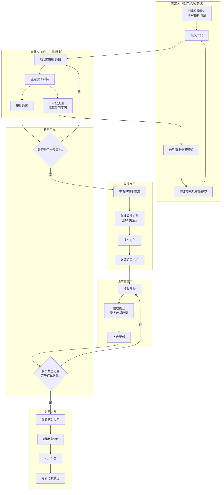

#### 10.1.4 状态机图

**采购需求状态机**

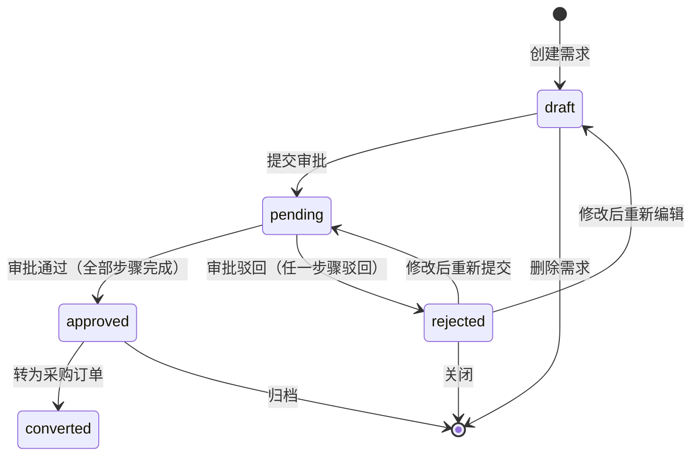

**采购订单状态机**

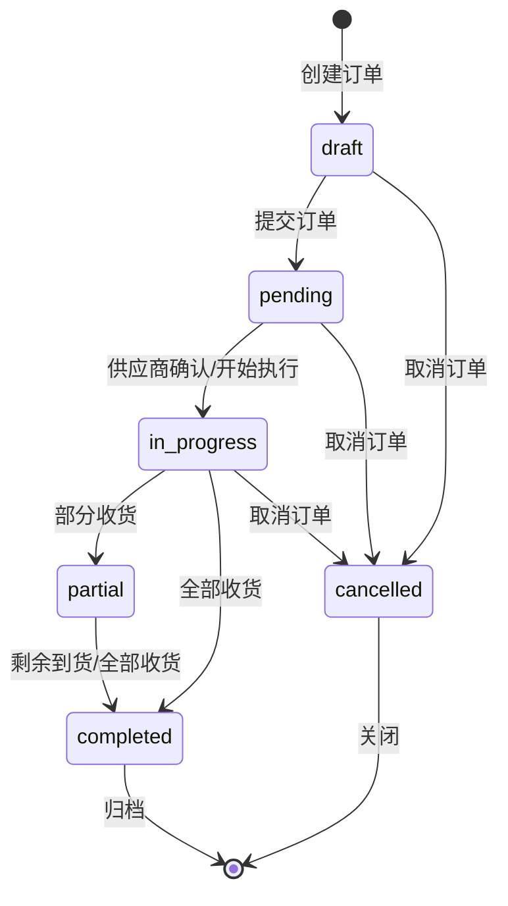

**审批实例状态机**

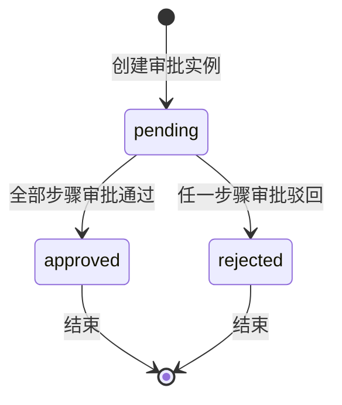

#### 10.1.5 功能清单表格

| 序号 | 模块 | 功能项 | 功能描述 | 优先级 | 关联API |
| --- | --- | --- | --- | --- | --- |
| 1 | 认证管理 | 用户登录 | 通过用户名密码登录，返回JWT令牌 | P0 | POST /api/auth/login |
| 2 | 认证管理 | 获取当前用户 | 获取当前登录用户信息及权限 | P0 | GET /api/auth/me |
| 3 | 工作台 | 统计概览 | 展示采购需求数、订单数、供应商数、库存预警数、待审批数、总采购金额 | P0 | GET /api/dashboard/stats |
| 4 | 采购需求 | 需求列表 | 分页查询采购需求，支持按状态、关键词筛选 | P0 | GET /api/purchase-requests |
| 5 | 采购需求 | 需求详情 | 查看需求基本信息及物料明细 | P0 | GET /api/purchase-requests/:id |
| 6 | 采购需求 | 创建需求 | 创建采购需求及物料明细，自动生成编号和计算总金额 | P0 | POST /api/purchase-requests |
| 7 | 采购需求 | 更新状态 | 更新采购需求状态（提交审批等） | P0 | PUT /api/purchase-requests/:id/status |
| 8 | 采购订单 | 订单列表 | 分页查询采购订单，支持按状态、关键词筛选 | P0 | GET /api/purchase-orders |
| 9 | 采购订单 | 订单详情 | 查看订单基本信息及物料明细 | P0 | GET /api/purchase-orders/:id |
| 10 | 采购订单 | 创建订单 | 创建采购订单及物料明细，自动生成编号和计算总金额 | P0 | POST /api/purchase-orders |
| 11 | 采购订单 | 更新状态 | 更新采购订单状态（执行、完成等） | P0 | PUT /api/purchase-orders/:id/status |
| 12 | 审批中心 | 待审批列表 | 查看当前用户待审批的事项 | P0 | GET /api/approvals |
| 13 | 审批中心 | 审批通过 | 对审批事项执行通过操作，支持填写意见 | P0 | POST /api/approvals/:id/approve |
| 14 | 审批中心 | 审批驳回 | 对审批事项执行驳回操作，必须填写驳回原因 | P0 | POST /api/approvals/:id/reject |
| 15 | 供应商管理 | 供应商列表 | 分页查询供应商，支持关键词搜索和状态筛选 | P1 | GET /api/suppliers |
| 16 | 供应商管理 | 供应商详情 | 查看供应商完整信息 | P1 | GET /api/suppliers/:id |
| 17 | 供应商管理 | 新增供应商 | 录入供应商基本信息 | P1 | POST /api/suppliers |
| 18 | 供应商管理 | 修改供应商 | 修改供应商信息，含评分和启停用 | P1 | PUT /api/suppliers/:id |
| 19 | 供应商管理 | 删除供应商 | 软删除供应商（停用） | P1 | DELETE /api/suppliers/:id |
| 20 | 物料管理 | 物料列表 | 分页查询物料，支持关键词搜索和品类筛选 | P1 | GET /api/items |
| 21 | 物料管理 | 新增物料 | 录入物料基本信息 | P1 | POST /api/items |
| 22 | 物料管理 | 修改物料 | 修改物料信息 | P1 | PUT /api/items/:id |
| 23 | 物料管理 | 删除物料 | 软删除物料（停用） | P1 | DELETE /api/items/:id |
| 24 | 合同管理 | 合同列表 | 分页查询合同，支持按状态筛选 | P1 | GET /api/contracts |
| 25 | 合同管理 | 新增合同 | 创建合同，自动生成编号 | P1 | POST /api/contracts |
| 26 | 合同管理 | 修改合同 | 修改合同信息，含状态变更 | P1 | PUT /api/contracts/:id |
| 27 | 付款管理 | 付款列表 | 分页查询付款记录，支持按状态筛选 | P1 | GET /api/payments |
| 28 | 付款管理 | 新增付款 | 创建付款记录，自动生成编号 | P1 | POST /api/payments |
| 29 | 库存管理 | 库存列表 | 分页查询库存，支持按仓库和关键词筛选 | P2 | GET /api/inventory |
| 30 | 库存管理 | 库存预警 | 查询低于安全库存的物料列表 | P2 | GET /api/inventory/alerts |
| 31 | 数据报表 | 采购汇总 | 按状态/供应商/月份统计采购数据 | P2 | GET /api/reports/purchase-summary |
| 32 | 数据报表 | 供应商表现 | 查看各供应商的订单量、金额、交付表现 | P2 | GET /api/reports/supplier-performance |

---

### 10.2 产品需求详解

#### 10.2.1 工作台（Dashboard）

**流程图**


**页面交互**

查询条件表：无（工作台为自动加载的概览页面，无需手动查询）

列表/展示字段表：

| 区域 | 展示字段 | 数据来源 | 说明 |
| --- | --- | --- | --- |
| 统计卡片1 | 采购需求总数 | purchase_requests表 | 不含deleted/cancelled状态 |
| 统计卡片2 | 采购订单总数 | purchase_orders表 | 不含deleted/cancelled状态 |
| 统计卡片3 | 供应商总数 | suppliers表 | 仅统计启用状态的供应商 |
| 统计卡片4 | 库存预警数 | inventory表 | 当前数量 <= 最低库存的物料数 |
| 统计卡片5 | 待审批数 | approval_instances表 | 状态为pending的审批实例数 |
| 统计卡片6 | 采购总金额 | purchase_orders表 | 所有订单的total_amount合计 |

操作按钮表：

| 按钮 | 位置 | 行为 | 权限要求 |
| --- | --- | --- | --- |
| 快捷入口-采购需求 | 工作台区域 | 跳转至采购需求列表页 | 已登录 |
| 快捷入口-采购订单 | 工作台区域 | 跳转至采购订单列表页 | 已登录 |
| 快捷入口-审批中心 | 工作台区域 | 跳转至审批中心页 | 已登录 |
| 快捷入口-库存预警 | 工作台区域 | 跳转至库存预警列表 | 已登录 |

**业务规则**

| 规则类型 | 规则编号 | 规则描述 |
| --- | --- | --- |
| 事实 | D-001 | 工作台统计数据通过GET /api/dashboard/stats接口一次性获取 |
| 事实 | D-002 | 统计数据为实时计算，每次进入页面重新请求 |
| 约束 | D-003 | 统计卡片中采购需求数和订单数排除已删除和已取消状态 |
| 约束 | D-004 | 库存预警数仅统计当前库存数量小于等于最低库存（min_quantity）的物料 |
| 推论 | D-005 | 当待审批数大于0时，审批中心快捷入口应显示红色角标提示 |

---

#### 10.2.2 采购需求管理

**流程图**

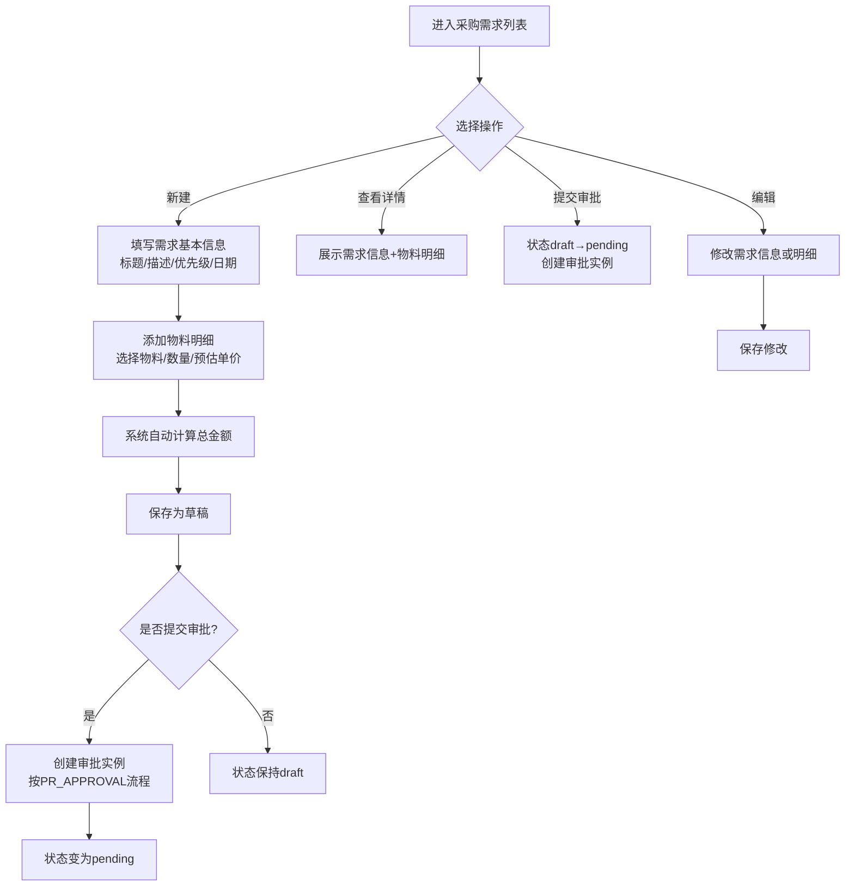

**页面交互**

查询条件表：

| 查询字段 | 字段类型 | 是否必填 | 默认值 | 说明 |
| --- | --- | --- | --- | --- |
| 状态 | 下拉选择 | 否 | 全部 | 选项：全部/draft/pending/approved/rejected/converted |
| 关键词 | 文本输入 | 否 | 空 | 模糊匹配标题和需求编号 |

列表字段表：

| 列名 | 字段 | 对齐方式 | 说明 |
| --- | --- | --- | --- |
| 需求编号 | request_no | 左 | 格式：PR-年份-6位时间戳 |
| 标题 | title | 左 | 需求标题 |
| 状态 | status | 居中 | 带颜色标签：draft灰/pending蓝/approved绿/rejected红 |
| 优先级 | priority | 居中 | high红/normal黄/low绿 |
| 需求日期 | request_date | 居中 | 格式：YYYY-MM-DD |
| 期望到货日期 | required_date | 居中 | 格式：YYYY-MM-DD |
| 需求人 | requester_name | 左 | 关联users表real_name |
| 部门 | department_name | 左 | 关联departments表name |
| 总金额 | total_amount | 右 | 格式：￥X,XXX.XX |
| 创建时间 | created_at | 居中 | 格式：YYYY-MM-DD HH:mm:ss |

操作按钮表：

| 按钮 | 显示条件 | 行为 | 权限要求 |
| --- | --- | --- | --- |
| 新建需求 | 页面顶部常驻 | 打开新建需求弹窗 | purchaser/admin |
| 查看详情 | 每行操作列 | 打开详情弹窗，展示完整信息及物料明细 | 已登录 |
| 提交审批 | 状态为draft | 将状态更新为pending，创建审批实例 | purchaser/admin |
| 编辑 | 状态为draft | 打开编辑弹窗 | purchaser/admin |
| 删除 | 状态为draft | 软删除需求 | admin |

新建需求弹窗字段表：

| 字段 | 类型 | 是否必填 | 校验规则 | 说明 |
| --- | --- | --- | --- | --- |
| 标题 | 文本输入 | 是 | 最长200字符 | 需求标题 |
| 描述 | 文本域 | 否 | - | 需求详细说明 |
| 优先级 | 下拉选择 | 否 | 默认normal | high/normal/low |
| 需求日期 | 日期选择 | 是 | 不超过今天 | 格式YYYY-MM-DD |
| 期望到货日期 | 日期选择 | 否 | 不早于需求日期 | 格式YYYY-MM-DD |
| 物料明细 | 动态表格 | 是 | 至少1条 | 见下方明细表 |

物料明细字段表：

| 字段 | 类型 | 是否必填 | 校验规则 |
| --- | --- | --- | --- |
| 物料 | 下拉选择（关联items） | 是 | 从物料列表中选择 |
| 数量 | 数字输入 | 是 | 大于0，最多2位小数 |
| 预估单价 | 数字输入 | 否 | 大于0，最多2位小数 |
| 描述 | 文本输入 | 否 | - |

**业务规则**

| 规则类型 | 规则编号 | 规则描述 |
| --- | --- | --- |
| 事实 | PR-001 | 采购需求编号格式为PR-{年份}-{6位时间戳}，如PR-2026-123456 |
| 事实 | PR-002 | 新建采购需求时状态默认为draft |
| 事实 | PR-003 | 采购需求总金额 = SUM(各明细项数量 x 预估单价) |
| 约束 | PR-004 | 标题、需求日期和物料明细为必填项，缺一不可提交 |
| 约束 | PR-005 | 仅draft状态的需求可以编辑和删除 |
| 约束 | PR-006 | 仅draft状态的需求可以提交审批 |
| 约束 | PR-007 | 需求编号全局唯一，由系统自动生成，不可修改 |
| 约束 | PR-008 | 需求人（requester_id）自动取当前登录用户，不可手动修改 |
| 约束 | PR-009 | 部门（department_id）自动取当前登录用户所属部门 |
| 触发条件 | PR-010 | 当需求提交审批时，系统自动创建审批实例（approval_instances），关联PR_APPROVAL工作流 |
| 触发条件 | PR-011 | 当审批实例全部步骤通过时，需求状态自动变为approved |
| 触发条件 | PR-012 | 当审批实例任一步骤驳回时，需求状态自动变为rejected |
| 推论 | PR-013 | rejected状态的需求可以修改后重新提交审批（状态流转：rejected → draft → pending） |
| 计算 | PR-014 | 总金额在创建时自动计算，公式：total_amount = SUM(quantity * estimated_price) |

---

#### 10.2.3 采购订单管理

**流程图**

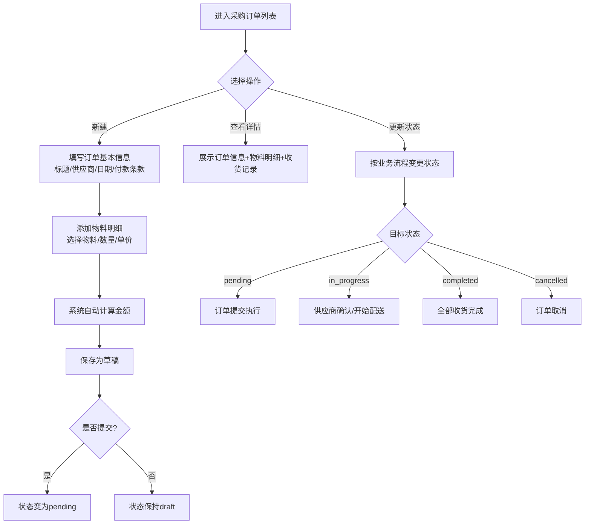

**页面交互**

查询条件表：

| 查询字段 | 字段类型 | 是否必填 | 默认值 | 说明 |
| --- | --- | --- | --- | --- |
| 状态 | 下拉选择 | 否 | 全部 | 选项：全部/draft/pending/in_progress/partial/completed/cancelled |
| 关键词 | 文本输入 | 否 | 空 | 模糊匹配标题和订单编号 |

列表字段表：

| 列名 | 字段 | 对齐方式 | 说明 |
| --- | --- | --- | --- |
| 订单编号 | order_no | 左 | 格式：PO-年份-6位时间戳 |
| 标题 | title | 左 | 订单标题 |
| 状态 | status | 居中 | 带颜色标签：draft灰/pending蓝/in_progress橙/completed绿/cancelled红 |
| 供应商 | supplier_name | 左 | 关联suppliers表name |
| 订单日期 | order_date | 居中 | 格式：YYYY-MM-DD |
| 期望交货日期 | expected_delivery_date | 居中 | 格式：YYYY-MM-DD |
| 总金额 | total_amount | 右 | 格式：￥X,XXX.XX |
| 创建人 | creator_name | 左 | 关联users表real_name |
| 创建时间 | created_at | 居中 | 格式：YYYY-MM-DD HH:mm:ss |

操作按钮表：

| 按钮 | 显示条件 | 行为 | 权限要求 |
| --- | --- | --- | --- |
| 新建订单 | 页面顶部常驻 | 打开新建订单弹窗 | purchaser/admin |
| 查看详情 | 每行操作列 | 打开详情弹窗 | 已登录 |
| 更新状态 | 每行操作列 | 打开状态下拉选择器 | purchaser/admin |
| 编辑 | 状态为draft | 打开编辑弹窗 | purchaser/admin |

新建订单弹窗字段表：

| 字段 | 类型 | 是否必填 | 校验规则 | 说明 |
| --- | --- | --- | --- | --- |
| 关联需求 | 下拉选择 | 否 | 仅显示approved状态的需求 | 可选，关联purchase_request |
| 标题 | 文本输入 | 是 | 最长200字符 | 订单标题 |
| 描述 | 文本域 | 否 | - | 订单详细说明 |
| 供应商 | 下拉选择 | 是 | 从启用状态的供应商中选择 | 关联suppliers |
| 订单日期 | 日期选择 | 是 | 不超过今天 | 格式YYYY-MM-DD |
| 期望交货日期 | 日期选择 | 否 | 不早于订单日期 | 格式YYYY-MM-DD |
| 付款条款 | 文本输入 | 否 | - | 如"月结30天"、"货到付款" |
| 收货地址 | 文本输入 | 否 | - | 物资送达地址 |
| 联系人 | 文本输入 | 否 | - | 收货联系人 |
| 联系电话 | 文本输入 | 否 | - | 收货联系电话 |
| 物料明细 | 动态表格 | 是 | 至少1条 | 见下方明细表 |

物料明细字段表：

| 字段 | 类型 | 是否必填 | 校验规则 |
| --- | --- | --- | --- |
| 物料 | 下拉选择（关联items） | 是 | 从物料列表中选择 |
| 数量 | 数字输入 | 是 | 大于0，最多2位小数 |
| 单价 | 数字输入 | 是 | 大于0，最多2位小数 |
| 金额 | 自动计算 | - | 金额 = 数量 x 单价 |
| 描述 | 文本输入 | 否 | - |

**业务规则**

| 规则类型 | 规则编号 | 规则描述 |
| --- | --- | --- |
| 事实 | PO-001 | 采购订单编号格式为PO-{年份}-{6位时间戳}，如PO-2026-123456 |
| 事实 | PO-002 | 新建采购订单时状态默认为draft |
| 事实 | PO-003 | 采购订单总金额 = SUM(各明细项数量 x 单价) |
| 事实 | PO-004 | 每个订单明细行自动计算金额（amount = quantity * unit_price） |
| 约束 | PO-005 | 标题、订单日期、供应商和物料明细为必填项 |
| 约束 | PO-006 | 仅draft状态的订单可以编辑 |
| 约束 | PO-007 | 订单编号全局唯一，由系统自动生成 |
| 约束 | PO-008 | 创建人（created_by）自动取当前登录用户 |
| 约束 | PO-009 | 供应商必须为启用状态（is_active = 1） |
| 触发条件 | PO-010 | 当选择关联需求时，系统自动带入需求的物料明细作为参考 |
| 推论 | PO-011 | 当订单状态变为completed时，表示所有物料已全部收货 |
| 推论 | PO-012 | 当订单状态变为cancelled时，关联的付款记录应同步标记为取消 |
| 计算 | PO-013 | 总金额在创建时自动计算，公式：total_amount = SUM(quantity * unit_price) |

---

#### 10.2.4 供应商管理

**流程图**

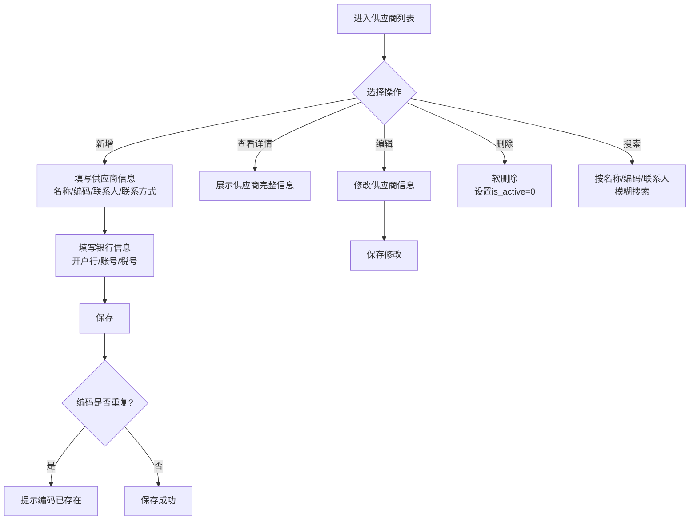

**页面交互**

查询条件表：

| 查询字段 | 字段类型 | 是否必填 | 默认值 | 说明 |
| --- | --- | --- | --- | --- |
| 关键词 | 文本输入 | 否 | 空 | 模糊匹配名称、编码、联系人 |
| 状态 | 下拉选择 | 否 | 启用 | 选项：全部/启用(active)/停用(inactive) |

列表字段表：

| 列名 | 字段 | 对齐方式 | 说明 |
| --- | --- | --- | --- |
| 供应商编码 | code | 左 | 如SUP-001 |
| 供应商名称 | name | 左 | 供应商全称 |
| 联系人 | contactName | 左 | 联系人姓名 |
| 联系电话 | contactPhone | 左 | 联系电话号码 |
| 邮箱 | email | 左 | 联系邮箱 |
| 评分 | rating | 居中 | 1.00-5.00分，星级展示 |
| 状态 | isActive | 居中 | 启用/停用标签 |
| 创建时间 | createdAt | 居中 | 格式：YYYY-MM-DD HH:mm:ss |

操作按钮表：

| 按钮 | 显示条件 | 行为 | 权限要求 |
| --- | --- | --- | --- |
| 新增供应商 | 页面顶部常驻 | 打开新增供应商弹窗 | purchaser/admin |
| 查看详情 | 每行操作列 | 打开详情弹窗 | 已登录 |
| 编辑 | 每行操作列 | 打开编辑弹窗 | purchaser/admin |
| 删除 | 每行操作列（启用状态） | 确认后软删除 | admin |

新增/编辑供应商弹窗字段表：

| 字段 | 类型 | 是否必填 | 校验规则 | 说明 |
| --- | --- | --- | --- | --- |
| 供应商名称 | 文本输入 | 是 | 最长200字符 | 供应商全称 |
| 供应商编码 | 文本输入 | 是 | 最长50字符，唯一 | 新增时必填，编辑时不可修改 |
| 联系人 | 文本输入 | 否 | 最长100字符 | 对接联系人姓名 |
| 联系电话 | 文本输入 | 否 | 最长50字符 | 联系电话 |
| 邮箱 | 文本输入 | 否 | 邮箱格式校验 | 联系邮箱 |
| 地址 | 文本域 | 否 | - | 供应商地址 |
| 开户银行 | 文本输入 | 否 | 最长200字符 | 银行名称 |
| 银行账号 | 文本输入 | 否 | 最长100字符 | 银行账号 |
| 税号 | 文本输入 | 否 | 最长100字符 | 纳税人识别号 |
| 评分 | 数字输入 | 否 | 0.00-5.00，2位小数 | 供应商评分 |

**业务规则**

| 规则类型 | 规则编号 | 规则描述 |
| --- | --- | --- |
| 事实 | SUP-001 | 供应商编码全局唯一，不可重复 |
| 事实 | SUP-002 | 供应商评分范围0.00-5.00，默认0.00 |
| 约束 | SUP-003 | 供应商名称和编码为必填项 |
| 约束 | SUP-004 | 删除操作为软删除，将is_active设为0，不物理删除数据 |
| 约束 | SUP-005 | 供应商编码创建后不可修改 |
| 触发条件 | SUP-006 | 当供应商编码重复时，返回错误提示"供应商编码已存在" |
| 推论 | SUP-007 | 停用的供应商在创建采购订单时不可选择 |

---

#### 10.2.5 物料管理

**流程图**

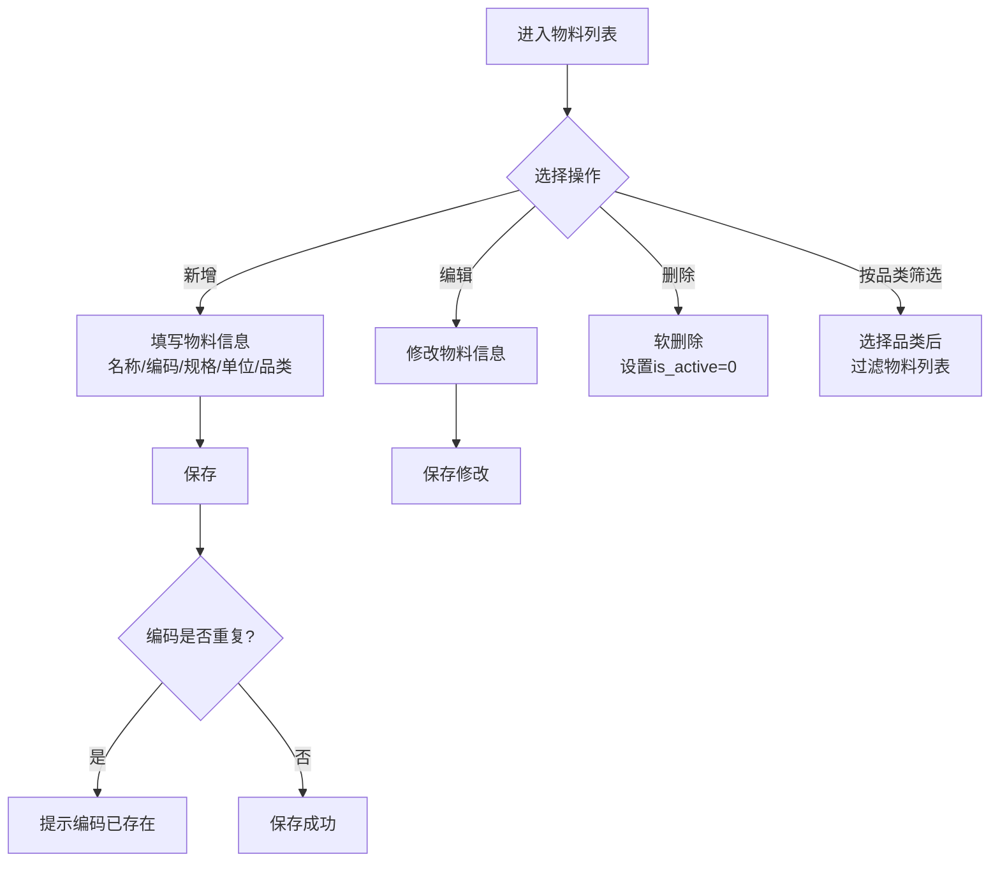

**页面交互**

查询条件表：

| 查询字段 | 字段类型 | 是否必填 | 默认值 | 说明 |
| --- | --- | --- | --- | --- |
| 关键词 | 文本输入 | 否 | 空 | 模糊匹配物料名称和编码 |
| 品类 | 下拉选择 | 否 | 全部 | 关联item_categories表 |

列表字段表：

| 列名 | 字段 | 对齐方式 | 说明 |
| --- | --- | --- | --- |
| 物料编码 | code | 左 | 如RICE-001 |
| 物料名称 | name | 左 | 物料名称 |
| 规格 | specification | 左 | 如50kg/袋 |
| 单位 | unit | 居中 | 如袋、桶、条、台、瓶 |
| 品类 | category_name | 左 | 关联item_categories表 |
| 描述 | description | 左 | 物料描述 |
| 创建时间 | created_at | 居中 | 格式：YYYY-MM-DD HH:mm:ss |

操作按钮表：

| 按钮 | 显示条件 | 行为 | 权限要求 |
| --- | --- | --- | --- |
| 新增物料 | 页面顶部常驻 | 打开新增物料弹窗 | purchaser/admin |
| 编辑 | 每行操作列 | 打开编辑弹窗 | purchaser/admin |
| 删除 | 每行操作列（启用状态） | 确认后软删除 | admin |

新增/编辑物料弹窗字段表：

| 字段 | 类型 | 是否必填 | 校验规则 | 说明 |
| --- | --- | --- | --- | --- |
| 物料名称 | 文本输入 | 是 | 最长200字符 | 物料名称 |
| 物料编码 | 文本输入 | 是 | 最长50字符，唯一 | 新增时必填，编辑时不可修改 |
| 规格型号 | 文本输入 | 否 | 最长200字符 | 如50kg/袋、1.8m白色纯棉 |
| 计量单位 | 文本输入 | 是 | 最长50字符 | 如袋、桶、条、台、瓶 |
| 所属品类 | 下拉选择 | 否 | 关联item_categories | 物料所属品类 |
| 描述 | 文本域 | 否 | - | 物料详细描述 |

**业务规则**

| 规则类型 | 规则编号 | 规则描述 |
| --- | --- | --- |
| 事实 | ITM-001 | 物料编码全局唯一，不可重复 |
| 事实 | ITM-002 | 物料品类支持树形结构（parent_id自引用），本期仅使用一级品类 |
| 约束 | ITM-003 | 物料名称、编码和计量单位为必填项 |
| 约束 | ITM-004 | 删除操作为软删除，将is_active设为0 |
| 约束 | ITM-005 | 物料编码创建后不可修改 |
| 触发条件 | ITM-006 | 当物料编码重复时，返回错误提示"物料编码已存在" |
| 推论 | ITM-007 | 已关联采购需求或订单的物料不建议删除，应停用处理 |

---

#### 10.2.6 审批中心

**流程图**

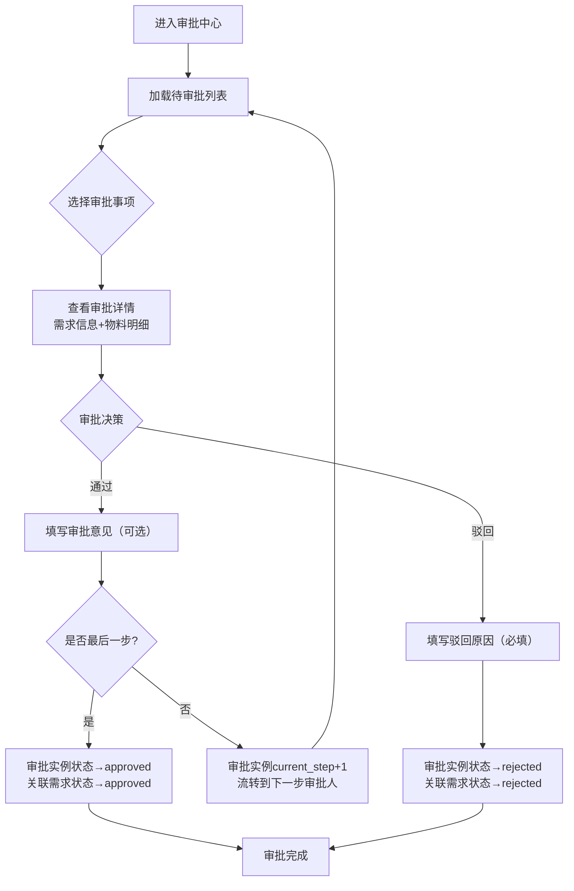

**页面交互**

查询条件表：无（审批中心默认展示当前用户待审批的事项）

列表字段表：

| 列名 | 字段 | 对齐方式 | 说明 |
| --- | --- | --- | --- |
| 审批标题 | title | 左 | 关联实体的标题 |
| 实体类型 | entity_type | 居中 | 如purchase_request |
| 当前步骤 | current_step | 居中 | 当前审批步骤编号 |
| 发起人 | initiator_name | 左 | 关联users表real_name |
| 发起时间 | created_at | 居中 | 格式：YYYY-MM-DD HH:mm:ss |

操作按钮表：

| 按钮 | 显示条件 | 行为 | 权限要求 |
| --- | --- | --- | --- |
| 通过 | 每行操作列 | 打开审批通过确认弹窗，可填写意见 | admin/finance |
| 驳回 | 每行操作列 | 打开审批驳回弹窗，必须填写驳回原因 | admin/finance |
| 查看详情 | 每行操作列 | 展示关联实体的完整信息 | 已登录 |

审批通过弹窗字段表：

| 字段 | 类型 | 是否必填 | 说明 |
| --- | --- | --- | --- |
| 审批意见 | 文本域 | 否 | 审批人填写的通过意见 |

审批驳回弹窗字段表：

| 字段 | 类型 | 是否必填 | 说明 |
| --- | --- | --- | --- |
| 驳回原因 | 文本域 | 是 | 必须填写驳回原因，便于需求人修改 |

**业务规则**

| 规则类型 | 规则编号 | 规则描述 |
| --- | --- | --- |
| 事实 | APR-001 | 审批中心仅展示状态为pending的审批实例 |
| 事实 | APR-002 | 审批流程定义存储在workflow_definitions表中，steps字段为JSON格式 |
| 事实 | APR-003 | 系统预置两个审批流程：PR_APPROVAL（2步：部门主管→财务）和PO_APPROVAL（1步：采购经理） |
| 约束 | APR-004 | 审批驳回时必须填写驳回原因 |
| 约束 | APR-005 | 审批通过操作使用数据库事务，确保审批历史记录和状态更新的原子性 |
| 触发条件 | APR-006 | 当审批通过且为最后一步时，审批实例状态变为approved，同时更新关联实体状态 |
| 触发条件 | APR-007 | 当审批通过但非最后一步时，审批实例的current_step加1，等待下一步审批人处理 |
| 触发条件 | APR-008 | 当审批驳回时，审批实例状态变为rejected，同时更新关联实体状态为rejected |
| 推论 | APR-009 | 每次审批操作（通过或驳回）都会在approval_history表中记录一条历史，包含步骤、审批人、操作和意见 |

---

#### 10.2.7 合同管理

**流程图**

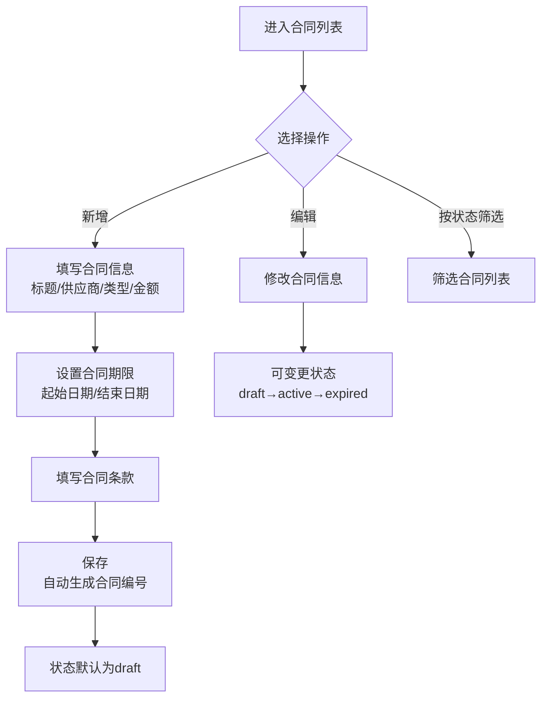

**页面交互**

查询条件表：

| 查询字段 | 字段类型 | 是否必填 | 默认值 | 说明 |
| --- | --- | --- | --- | --- |
| 状态 | 下拉选择 | 否 | 全部 | 选项：全部/draft/active/expired/cancelled |

列表字段表：

| 列名 | 字段 | 对齐方式 | 说明 |
| --- | --- | --- | --- |
| 合同编号 | contract_no | 左 | 格式：CT-年份-6位时间戳 |
| 合同标题 | title | 左 | 合同名称 |
| 供应商 | supplier_name | 左 | 关联suppliers表 |
| 类型 | type | 居中 | framework(框架合同)/single(单次合同) |
| 金额 | amount | 右 | 格式：￥X,XXX.XX |
| 起始日期 | start_date | 居中 | 格式：YYYY-MM-DD |
| 结束日期 | end_date | 居中 | 格式：YYYY-MM-DD |
| 状态 | status | 居中 | draft灰/active绿/expired红 |
| 创建人 | creator_name | 左 | 关联users表 |

操作按钮表：

| 按钮 | 显示条件 | 行为 | 权限要求 |
| --- | --- | --- | --- |
| 新增合同 | 页面顶部常驻 | 打开新增合同弹窗 | admin/finance |
| 编辑 | 每行操作列 | 打开编辑弹窗，可修改状态 | admin/finance |

新增合同弹窗字段表：

| 字段 | 类型 | 是否必填 | 校验规则 | 说明 |
| --- | --- | --- | --- | --- |
| 合同编号 | 文本输入 | 否 | 唯一 | 不填则自动生成CT-年份-6位时间戳 |
| 合同标题 | 文本输入 | 是 | 最长200字符 | 合同名称 |
| 供应商 | 下拉选择 | 否 | 从启用供应商中选择 | 关联suppliers |
| 合同类型 | 下拉选择 | 否 | - | framework(框架合同)/single(单次合同) |
| 合同金额 | 数字输入 | 否 | 大于0，2位小数 | 合同总金额 |
| 起始日期 | 日期选择 | 否 | - | 合同生效日期 |
| 结束日期 | 日期选择 | 否 | 晚于起始日期 | 合同到期日期 |
| 合同条款 | 文本域 | 否 | - | 合同关键条款说明 |

**业务规则**

| 规则类型 | 规则编号 | 规则描述 |
| --- | --- | --- |
| 事实 | CT-001 | 合同编号格式为CT-{年份}-{6位时间戳}，如CT-2026-123456 |
| 事实 | CT-002 | 新建合同时状态默认为draft |
| 约束 | CT-003 | 合同标题为必填项 |
| 约束 | CT-004 | 合同编号全局唯一 |
| 触发条件 | CT-005 | 不填写合同编号时，系统自动生成 |
| 推论 | CT-006 | 合同到期后应手动将状态更新为expired |

---

#### 10.2.8 付款管理

**流程图**

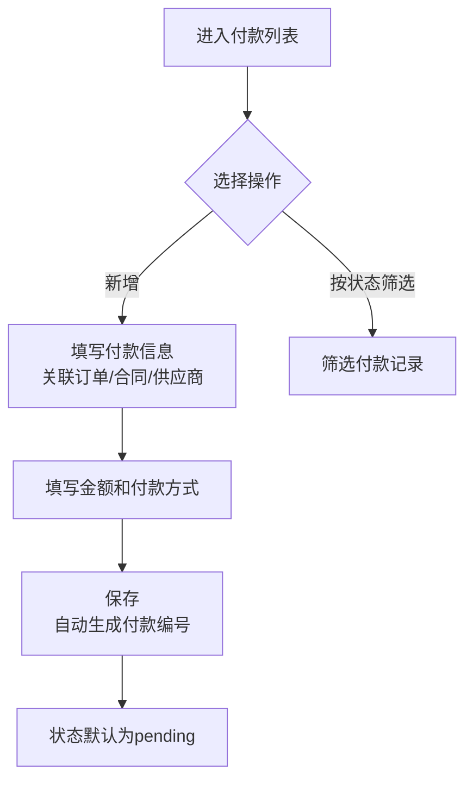

**页面交互**

查询条件表：

| 查询字段 | 字段类型 | 是否必填 | 默认值 | 说明 |
| --- | --- | --- | --- | --- |
| 状态 | 下拉选择 | 否 | 全部 | 选项：全部/pending/completed/cancelled |

列表字段表：

| 列名 | 字段 | 对齐方式 | 说明 |
| --- | --- | --- | --- |
| 付款编号 | payment_no | 左 | 格式：PAY-年份-6位时间戳 |
| 供应商 | supplier_name | 左 | 关联suppliers表 |
| 付款金额 | amount | 右 | 格式：￥X,XXX.XX |
| 付款日期 | payment_date | 居中 | 格式：YYYY-MM-DD |
| 付款方式 | payment_method | 居中 | 银行转账/现金/支票等 |
| 状态 | status | 居中 | pending蓝/completed绿/cancelled红 |
| 参考编号 | reference_no | 左 | 银行流水号等 |
| 创建人 | creator_name | 左 | 关联users表 |
| 创建时间 | created_at | 居中 | 格式：YYYY-MM-DD HH:mm:ss |

操作按钮表：

| 按钮 | 显示条件 | 行为 | 权限要求 |
| --- | --- | --- | --- |
| 新增付款 | 页面顶部常驻 | 打开新增付款弹窗 | admin/finance |

新增付款弹窗字段表：

| 字段 | 类型 | 是否必填 | 校验规则 | 说明 |
| --- | --- | --- | --- | --- |
| 关联订单 | 下拉选择 | 否 | 从采购订单中选择 | 关联purchase_orders |
| 关联合同 | 下拉选择 | 否 | 从合同中选择 | 关联contracts |
| 供应商 | 下拉选择 | 否 | 从启用供应商中选择 | 关联suppliers |
| 付款金额 | 数字输入 | 是 | 大于0，2位小数 | 付款金额 |
| 付款日期 | 日期选择 | 是 | - | 实际付款日期 |
| 付款方式 | 下拉选择 | 否 | - | 银行转账/现金/支票 |
| 参考编号 | 文本输入 | 否 | 最长100字符 | 银行流水号等 |
| 备注 | 文本域 | 否 | - | 付款备注说明 |

**业务规则**

| 规则类型 | 规则编号 | 规则描述 |
| --- | --- | --- |
| 事实 | PAY-001 | 付款编号格式为PAY-{年份}-{6位时间戳}，如PAY-2026-123456 |
| 事实 | PAY-002 | 新建付款时状态默认为pending |
| 约束 | PAY-003 | 付款金额和付款日期为必填项 |
| 约束 | PAY-004 | 创建人（created_by）自动取当前登录用户 |
| 推论 | PAY-005 | 付款状态从pending变更为completed表示付款已完成 |

---

#### 10.2.9 库存管理

**流程图**

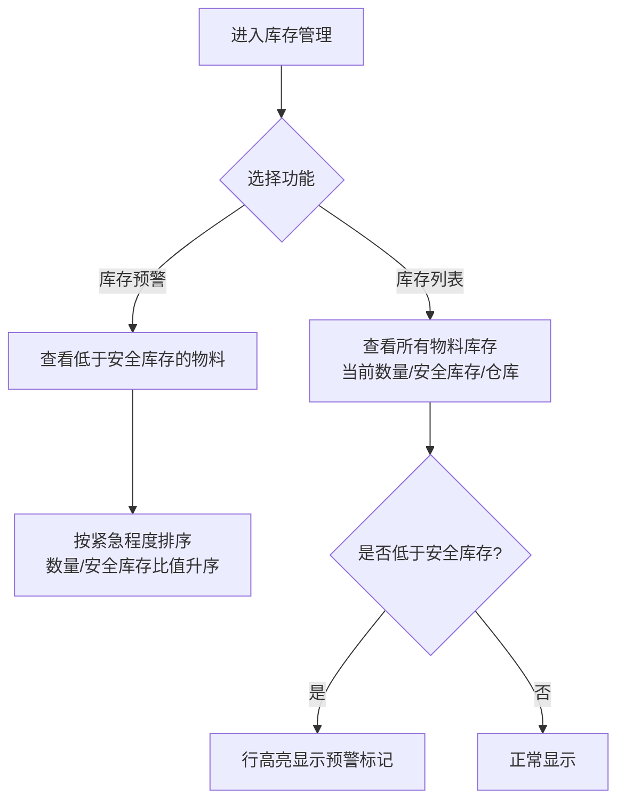

**页面交互**

查询条件表：

| 查询字段 | 字段类型 | 是否必填 | 默认值 | 说明 |
| --- | --- | --- | --- | --- |
| 关键词 | 文本输入 | 否 | 空 | 模糊匹配物料名称和编码 |
| 仓库 | 下拉选择 | 否 | 全部 | 如主食仓库、布草间、设备仓库等 |

列表字段表：

| 列名 | 字段 | 对齐方式 | 说明 |
| --- | --- | --- | --- |
| 物料编码 | item_code | 左 | 关联items表code |
| 物料名称 | item_name | 左 | 关联items表name |
| 规格 | specification | 左 | 关联items表 |
| 单位 | unit | 居中 | 关联items表 |
| 仓库 | warehouse | 左 | 如主食仓库、布草间 |
| 当前数量 | quantity | 右 | 当前库存数量 |
| 最低库存 | min_quantity | 右 | 安全库存下限 |
| 最高库存 | max_quantity | 右 | 安全库存上限 |
| 单位成本 | unit_cost | 右 | 格式：￥X,XXX.XX |
| 最后入库日期 | last_in_date | 居中 | 格式：YYYY-MM-DD |
| 最后出库日期 | last_out_date | 居中 | 格式：YYYY-MM-DD |

操作按钮表：

| 按钮 | 显示条件 | 行为 | 权限要求 |
| --- | --- | --- | --- |
| 库存预警 | 页面顶部Tab切换 | 切换到库存预警视图 | 已登录 |

库存预警列表字段表：

| 列名 | 字段 | 对齐方式 | 说明 |
| --- | --- | --- | --- |
| 物料编码 | item_code | 左 | 关联items表code |
| 物料名称 | item_name | 左 | 关联items表name |
| 品类 | category_name | 左 | 关联item_categories表 |
| 当前数量 | quantity | 右 | 当前库存数量 |
| 最低库存 | min_quantity | 右 | 安全库存下限 |
| 缺口数量 | - | 右 | 自动计算：min_quantity - quantity |

**业务规则**

| 规则类型 | 规则编号 | 规则描述 |
| --- | --- | --- |
| 事实 | INV-001 | 每种物料在每个仓库最多有一条库存记录（item_id唯一约束） |
| 事实 | INV-002 | 库存预警条件：当前数量(quantity) <= 最低库存(min_quantity) |
| 约束 | INV-003 | 库存数量不允许为负数 |
| 推论 | INV-004 | 库存预警列表按"当前数量/最低库存"比值升序排列，比值越小表示越紧急 |
| 推论 | INV-005 | 当物料库存低于最低库存时，建议自动生成采购需求（本期为手动触发） |

---

#### 10.2.10 数据报表

**流程图**

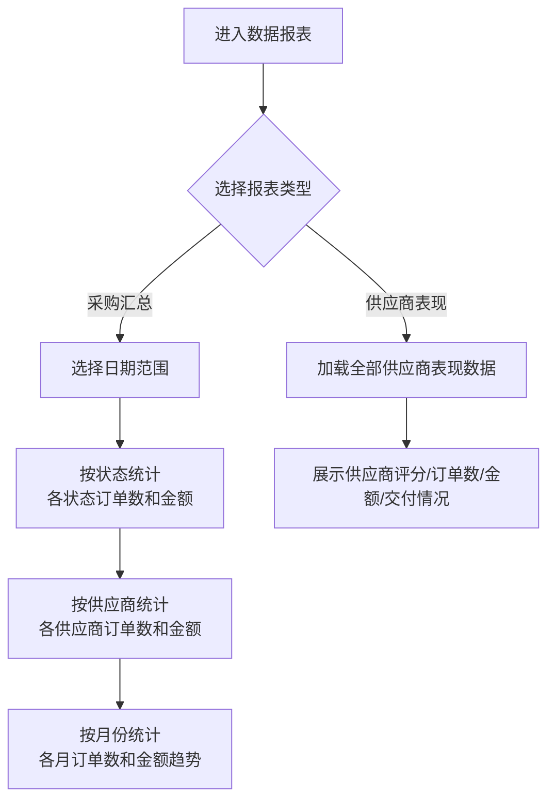

**页面交互**

采购汇总报表查询条件表：

| 查询字段 | 字段类型 | 是否必填 | 默认值 | 说明 |
| --- | --- | --- | --- | --- |
| 起始日期 | 日期选择 | 否 | 空 | 统计起始日期 |
| 结束日期 | 日期选择 | 否 | 空 | 统计结束日期 |

采购汇总报表展示字段表：

| 区域 | 展示维度 | 展示指标 | 说明 |
| --- | --- | --- | --- |
| 按状态统计 | 订单状态 | 订单数量、总金额 | 按draft/pending/in_progress/completed分组 |
| 按供应商统计 | 供应商名称 | 订单数量、总金额 | 按金额降序排列 |
| 按月份统计 | 月份（YYYY-MM） | 订单数量、总金额 | 按月份降序排列 |

供应商表现报表展示字段表：

| 列名 | 字段 | 对齐方式 | 说明 |
| --- | --- | --- | --- |
| 供应商名称 | name | 左 | 供应商全称 |
| 供应商编码 | code | 左 | 如SUP-001 |
| 联系人 | contact_person | 左 | 对接联系人 |
| 联系电话 | phone | 左 | 联系电话 |
| 评分 | rating | 居中 | 1.00-5.00分，星级展示 |
| 订单总数 | order_count | 右 | 历史订单总数 |
| 订单总金额 | total_amount | 右 | 历史订单总金额 |
| 完全交付次数 | completed_receipts | 右 | 收货状态为completed的次数 |
| 部分交付次数 | partial_receipts | 右 | 收货状态为partial的次数 |

操作按钮表：

| 按钮 | 位置 | 行为 | 权限要求 |
| --- | --- | --- | --- |
| 查询 | 报表顶部 | 根据查询条件刷新报表数据 | 已登录 |
| 重置 | 报表顶部 | 清空查询条件，重新加载 | 已登录 |

**业务规则**

| 规则类型 | 规则编号 | 规则描述 |
| --- | --- | --- |
| 事实 | RPT-001 | 采购汇总报表支持按日期范围筛选，不填则统计全部数据 |
| 事实 | RPT-002 | 供应商表现报表展示所有启用状态的供应商 |
| 事实 | RPT-003 | 供应商表现按评分降序排列 |
| 约束 | RPT-004 | 报表数据为只读，不支持在线编辑 |
| 推论 | RPT-005 | 供应商的"完全交付次数"和"部分交付次数"可用于计算交付准时率 |

---

### 10.3 异常情况处理方案

| 异常类型 | 场景描述 | 处理方案 | 用户提示 |
| --- | --- | --- | --- |
| 网络异常 | 前端与后端通信中断（网络断开、服务器宕机） | 前端显示网络错误提示，提供"重试"按钮；后端记录错误日志 | "网络连接异常，请检查网络后重试" |
| 并发冲突 | 两个用户同时编辑同一条采购需求 | 后端使用数据库行锁机制，后提交的请求基于最新数据更新；乐观锁通过updated_at字段判断 | "数据已被其他用户修改，请刷新后重试" |
| 数据异常 | 必填字段为空、数据格式错误、数值越界 | 前端表单校验拦截+后端参数校验双重防护；返回具体字段的错误信息 | "XX字段不能为空"/"XX格式不正确" |
| 误操作 | 用户误删重要数据（如已审批的采购需求） | 关键操作增加二次确认弹窗；仅允许删除draft状态的需求；删除为软删除，数据可恢复 | "确认要删除该条记录吗？此操作不可撤销" |
| 业务异常 | 采购需求关联的物料被停用 | 软删除的物料不影响已有需求的数据展示，但新建需求时不可选择已停用物料 | "该物料已停用，请选择其他物料" |
| 业务异常 | 审批流程中审批人不存在或离职 | 系统管理员可重新分配审批节点角色；当前步骤暂停等待管理员处理 | "当前审批人不可用，请联系系统管理员" |
| 认证异常 | JWT令牌过期（超过24小时） | 后端返回401状态码，前端自动跳转到登录页 | "登录已过期，请重新登录" |
| 认证异常 | 用户名或密码错误 | 后端返回统一错误提示，不区分用户名不存在和密码错误（安全考虑） | "用户名或密码错误" |
| 系统异常 | 数据库连接失败 | 后端返回500错误，前端显示友好提示；运维人员通过日志排查 | "系统异常，请稍后重试或联系管理员" |
| 数据异常 | 供应商编码/物料编码重复 | 后端捕获ER_DUP_ENTRY错误，返回友好的中文提示 | "供应商编码已存在"/"物料编码已存在" |

---

## 第11章 数据埋点

### 11.1 页面埋点

| 埋点事件 | 触发时机 | 埋点参数 | 说明 |
| --- | --- | --- | --- |
| page_view | 用户进入页面 | page_name, user_id, timestamp | 记录页面访问 |
| page_leave | 用户离开页面 | page_name, stay_duration | 记录页面停留时长 |

| 页面名称 | page_name值 |
| --- | --- |
| 登录页 | login |
| 工作台 | dashboard |
| 采购需求列表 | purchase_requests |
| 采购订单列表 | purchase_orders |
| 供应商列表 | suppliers |
| 物料列表 | items |
| 审批中心 | approvals |
| 合同列表 | contracts |
| 付款列表 | payments |
| 库存管理 | inventory |
| 数据报表 | reports |

### 11.2 行为埋点

| 埋点事件 | 触发时机 | 埋点参数 | 说明 |
| --- | --- | --- | --- |
| user_login | 用户点击登录按钮 | username, success, error_msg | 记录登录行为 |
| user_logout | 用户退出登录 | user_id | 记录退出行为 |
| create_pr | 创建采购需求 | user_id, department_id, item_count, total_amount | 记录需求创建 |
| submit_approval | 提交审批 | user_id, entity_type, entity_id | 记录审批提交 |
| approve_action | 审批通过 | user_id, approval_id, step | 记录审批通过 |
| reject_action | 审批驳回 | user_id, approval_id, step, reason | 记录审批驳回 |
| create_po | 创建采购订单 | user_id, supplier_id, item_count, total_amount | 记录订单创建 |
| create_payment | 创建付款 | user_id, supplier_id, amount, payment_method | 记录付款创建 |

### 11.3 业务指标埋点

| 指标名称 | 计算方式 | 统计周期 | 说明 |
| --- | --- | --- | --- |
| 采购需求创建量 | COUNT(create_pr) | 日/周/月 | 各时段需求创建数量 |
| 平均审批时长 | AVG(approval_complete_time - approval_start_time) | 周/月 | 审批效率指标 |
| 审批通过率 | COUNT(approve_action) / COUNT(approve_action + reject_action) | 月 | 审批质量指标 |
| 采购订单创建量 | COUNT(create_po) | 日/周/月 | 各时段订单创建数量 |
| 付款完成量 | COUNT(create_payment WHERE status=completed) | 月 | 付款执行情况 |
| 库存预警数 | COUNT(inventory WHERE quantity <= min_quantity) | 日 | 库存健康度指标 |
| 系统日活用户数 | COUNT(DISTINCT user_id WHERE page_view) | 日 | 系统使用活跃度 |

---

## 第12章 角色和权限

### 12.1 角色定义表

| 角色编码 | 角色名称 | 角色描述 | 默认用户 |
| --- | --- | --- | --- |
| admin | 系统管理员 | 拥有所有功能权限，负责系统配置和用户管理 | admin（管理员） |
| purchaser | 采购专员 | 负责采购需求创建、订单管理、物料和供应商维护 | 张三、王五、赵六 |
| finance | 财务人员 | 负责财务审批、合同管理、付款管理 | 李四 |

### 12.2 功能权限矩阵

以下矩阵定义了各角色对各功能模块的访问权限，精确到页面元素级别。

| 功能模块 | 权限项 | admin | purchaser | finance |
| --- | --- | --- | --- | --- |
| **工作台** | 查看统计概览 | Y | Y | Y |
| **采购需求** | 查看列表 | Y | Y | Y |
| **采购需求** | 查看详情 | Y | Y | Y |
| **采购需求** | 新建需求 | Y | Y | N |
| **采购需求** | 编辑需求 | Y | Y | N |
| **采购需求** | 删除需求 | Y | N | N |
| **采购需求** | 提交审批 | Y | Y | N |
| **采购需求** | 更新状态 | Y | Y | N |
| **采购订单** | 查看列表 | Y | Y | Y |
| **采购订单** | 查看详情 | Y | Y | Y |
| **采购订单** | 新建订单 | Y | Y | N |
| **采购订单** | 编辑订单 | Y | Y | N |
| **采购订单** | 更新状态 | Y | Y | N |
| **供应商** | 查看列表 | Y | Y | Y |
| **供应商** | 查看详情 | Y | Y | Y |
| **供应商** | 新增供应商 | Y | Y | N |
| **供应商** | 编辑供应商 | Y | Y | N |
| **供应商** | 删除供应商 | Y | N | N |
| **物料** | 查看列表 | Y | Y | Y |
| **物料** | 新增物料 | Y | Y | N |
| **物料** | 编辑物料 | Y | Y | N |
| **物料** | 删除物料 | Y | N | N |
| **审批中心** | 查看待审批列表 | Y | N | Y |
| **审批中心** | 审批通过 | Y | Y | Y |
| **审批中心** | 审批驳回 | Y | Y | Y |
| **合同** | 查看列表 | Y | Y | Y |
| **合同** | 新增合同 | Y | N | Y |
| **合同** | 编辑合同 | Y | N | Y |
| **付款** | 查看列表 | Y | Y | Y |
| **付款** | 新增付款 | Y | N | Y |
| **库存** | 查看库存列表 | Y | Y | Y |
| **库存** | 查看库存预警 | Y | Y | Y |
| **报表** | 查看采购汇总 | Y | Y | Y |
| **报表** | 查看供应商表现 | Y | Y | Y |
| **用户管理** | 管理用户和角色 | Y | N | N |

> Y = 允许，N = 禁止

### 12.3 数据权限设计

| 权限维度 | 规则说明 |
| --- | --- |
| 部门数据隔离 | 采购专员默认只能查看本部门创建的采购需求（通过department_id过滤），系统管理员可查看全部 |
| 审批数据可见性 | 审批人只能看到流转到当前步骤的待审批事项 |
| 供应商数据共享 | 供应商信息为全局共享数据，所有角色均可查看 |
| 库存数据共享 | 库存数据为全局共享数据，所有角色均可查看 |
| 报表数据权限 | 采购专员可查看与本人相关的采购数据报表；财务人员和管理员可查看全部报表 |

---

## 第13章 运营计划

### 13.1 上线发布计划

| 阶段 | 时间范围 | 覆盖范围 | 目标 | 关键活动 |
| --- | --- | --- | --- | --- |
| 试点期 | 上线后第1-4周 | 采购部（3人）+ 财务部（1人） | 验证核心流程，收集问题反馈 | 现场培训、每日问题跟进、快速修复 |
| 扩大期 | 上线后第5-8周 | 全部采购相关部门（含客房部、餐饮部等） | 扩大使用范围，优化用户体验 | 部门培训、操作手册发放、问题收集 |
| 全面期 | 上线后第9-12周 | 全酒店集团 | 全面替代原有手工流程 | 全员培训、旧流程停用、数据迁移完成 |

### 13.2 培训计划

| 培训对象 | 培训内容 | 培训方式 | 培训时长 | 培训时间 |
| --- | --- | --- | --- | --- |
| 采购专员 | 采购需求创建、订单管理、供应商维护、物料管理 | 现场实操培训 | 2小时 | 上线前1周 |
| 财务人员 | 审批操作、合同管理、付款管理、报表查看 | 现场实操培训 | 2小时 | 上线前1周 |
| 部门经理 | 采购需求提交、审批状态查看 | 现场演示 + 操作手册 | 1小时 | 扩大期第1周 |
| 系统管理员 | 系统配置、用户管理、权限分配、数据维护 | 一对一培训 | 3小时 | 上线前2周 |
| 全体用户 | 系统登录、基本操作、常见问题 | 线上视频 + 操作手册 | 自学 | 上线前发布 |

### 13.3 推广与采纳

| 措施 | 具体内容 | 负责人 | 时间节点 |
| --- | --- | --- | --- |
| 操作手册 | 编制各模块操作手册（PDF），放置在系统帮助中心 | 产品经理 | 上线前1周 |
| 常见问题FAQ | 整理上线初期常见问题和解答 | 产品经理 | 上线后2周 |
| 试点经验分享 | 采购部试点经验总结，向其他部门推广 | 采购总监 | 扩大期第1周 |
| 使用激励 | 对首批积极使用系统的部门给予表扬 | 酒店管理层 | 全面期 |
| 问题反馈渠道 | 建立企业微信群，实时解答用户问题 | 信息技术部 | 上线即启动 |

### 13.4 运营流程建设

| 运营事项 | 频率 | 负责人 | 说明 |
| --- | --- | --- | --- |
| 系统使用数据监控 | 每周 | 产品经理 | 监控DAU、功能使用率、页面停留时长 |
| 用户反馈收集与处理 | 每周 | 产品经理 | 收集问题反馈，按优先级排入迭代计划 |
| 系统功能迭代 | 每月 | 研发团队 | 每月发布一次功能更新 |
| 数据库备份检查 | 每日 | 运维人员 | 确保数据库备份正常执行 |
| 供应商数据维护 | 每月 | 采购部 | 更新供应商信息、评分、报价 |
| 物料主数据维护 | 按需 | 采购部 | 新增/修改/停用物料 |

---

## 第14章 待决事项

| 编号 | 待决事项 | 提出人 | 状态 | 决策截止日期 | 影响范围 |
| --- | --- | --- | --- | --- | --- |
| TBD-001 | 是否需要对接酒店现有财务系统进行付款数据同步 | 财务总监 | 待讨论 | 2026-07-15 | 付款管理模块 |
| TBD-002 | 采购需求的审批流程是否需要支持按金额设置不同的审批层级 | 采购总监 | 待讨论 | 2026-07-10 | 审批中心模块 |
| TBD-003 | 是否需要增加消息通知功能（邮件/短信/企业微信） | 信息技术部 | 待讨论 | 2026-07-20 | 全系统 |
| TBD-004 | 库存预警是否需要自动触发采购需求创建 | 仓储部经理 | 待讨论 | 2026-07-25 | 库存管理+采购需求 |
| TBD-005 | 是否需要支持Excel批量导入供应商和物料数据 | 采购部 | 待讨论 | 2026-07-15 | 供应商+物料模块 |
| TBD-006 | 供应商评分规则是否需要自动化（基于交付准时率、质量合格率等） | 采购总监 | 待讨论 | 2026-08-01 | 供应商管理模块 |
| TBD-007 | 系统部署方式：本地服务器还是云服务器 | 信息技术部 | 待讨论 | 2026-07-05 | 基础设施 |

---

## 附：待完善清单

### 必须完成（上线前）

| 编号 | 待完善事项 | 所属模块 | 优先级 | 负责人 |
| --- | --- | --- | --- | --- |
| F-001 | 完善JWT密钥管理，将密钥从硬编码改为环境变量读取 | 认证管理 | P0 | 研发 |
| F-002 | 增加API请求频率限制，防止暴力破解和DDoS攻击 | 安全 | P0 | 研发 |
| F-003 | 完善审计日志记录，覆盖所有关键业务操作 | 全系统 | P0 | 研发 |
| F-004 | 增加数据库定时备份机制 | 基础设施 | P0 | 运维 |
| F-005 | 完善前端表单校验，确保所有必填字段有明确提示 | 全系统 | P0 | 研发 |
| F-006 | 补充收货管理的前端页面和交互（当前仅有后端API） | 采购订单 | P0 | 研发 |
| F-007 | 增加采购需求从已审批状态转为采购订单的前端操作入口 | 采购需求→订单 | P0 | 研发 |

### 建议完成（上线后1个月内）

| 编号 | 待完善事项 | 所属模块 | 优先级 | 负责人 |
| --- | --- | --- | --- | --- |
| F-008 | 增加操作确认弹窗（删除、驳回等关键操作） | 全系统 | P1 | 研发 |
| F-009 | 增加数据导出功能（采购需求、订单、供应商列表导出Excel） | 全系统 | P1 | 研发 |
| F-010 | 完善合同到期提醒功能 | 合同管理 | P1 | 研发 |
| F-011 | 增加采购需求与采购订单的关联展示（从订单追溯到需求） | 采购订单 | P1 | 研发 |
| F-012 | 完善供应商报价管理的前端页面 | 供应商管理 | P1 | 研发 |
| F-013 | 增加发票管理的前端页面和交互 | 发票管理 | P1 | 研发 |

### 可选完成（后续迭代）

| 编号 | 待完善事项 | 所属模块 | 优先级 | 负责人 |
| --- | --- | --- | --- | --- |
| F-014 | 增加移动端适配（响应式布局） | 全系统 | P2 | 研发 |
| F-015 | 增加数据可视化图表（ECharts集成） | 数据报表 | P2 | 研发 |
| F-016 | 增加消息通知功能（站内消息 + 邮件） | 全系统 | P2 | 研发 |
| F-017 | 增加库存出入库事务记录的前端页面 | 库存管理 | P2 | 研发 |
| F-018 | 增加批量操作功能（批量审批、批量删除） | 审批/采购 | P2 | 研发 |
| F-019 | 增加系统操作日志查看页面（基于audit_logs表） | 系统管理 | P2 | 研发 |
| F-020 | 增加用户管理和角色管理的前端页面 | 系统管理 | P2 | 研发 |
